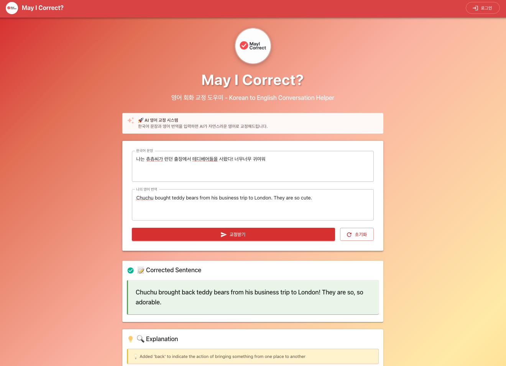
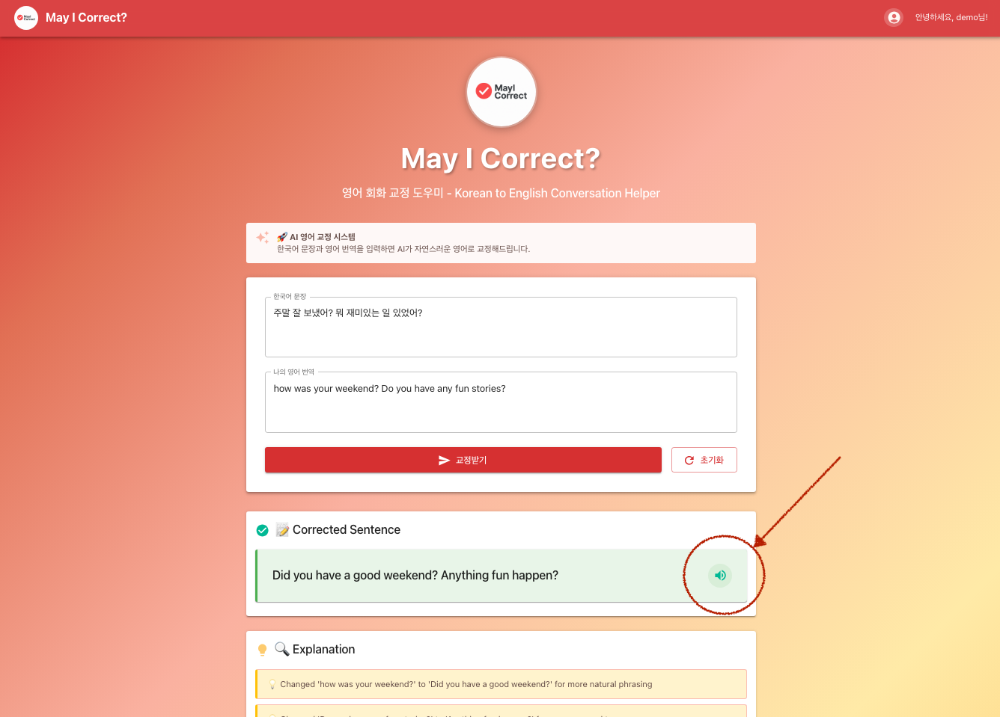
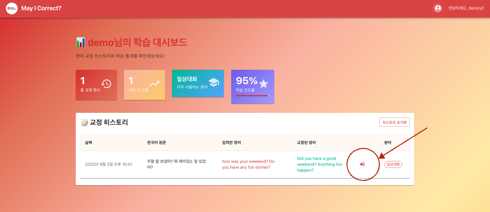

# May I Correct? 🚀

<div align="center">
  
  
  **AI-Powered English Correction System**  
  *Korean to English Conversation Helper*
  
  [](https://github.com/MayHyeyeonKim/MayICorrect)
  [](https://creativecommons.org/licenses/by-nc/4.0/)
  [](https://reactjs.org/)
  [](https://www.typescriptlang.org/)
  [](https://openai.com/)
</div>

<div align="center">
  
</div>

## 📖 Project Overview

**May I Correct?** is an **AI-powered English correction system** designed to help Korean learners practice English conversation. Built with OpenAI's GPT-3.5-turbo model, it provides natural and accurate English corrections with detailed explanations.

### ✨ Key Features

- **OpenAI GPT-based AI Correction**: Powered by cutting-edge AI technology for natural and accurate English corrections
- **High-Quality Text-to-Speech**: OpenAI TTS-1 model with Nova voice for natural English pronunciation
- **Real-time Grammar Analysis**: Grammar error detection and improvement suggestions
- **Voice Learning Support**: Listen to corrected sentences and vocabulary examples
- **Vocabulary Learning**: New words and expressions with usage examples
- **Smart Category Classification**: Automatic categorization (IT/Tech, Business, Daily Conversation, etc.)
- **Learning Dashboard**: Correction history and learning statistics with voice playback
- **History Management**: Save correction results and export data
- **User Authentication**: Login/logout and personal data management
- **Responsive Design**: Mobile and desktop optimized

### 🎯 Target Users

- Korean learners practicing English conversation
- Anyone who wants to learn natural English expressions
- Users looking for AI-based language learning tools
- Students who need systematic learning management

## 🛠️ Tech Stack

### Frontend

- **React 19** - Latest React features
- **TypeScript** - Type safety guaranteed
- **Vite 7.0.6** - Fast development server and build
- **Material-UI 7.2.0** - Modern UI components
- **React Router** - SPA routing
- **Emotion** - CSS-in-JS styling

### Backend

- **Node.js** - JavaScript runtime
- **Express 5.1.0** - Web framework
- **TypeScript** - Backend type safety
- **OpenAI API** - GPT-3.5-turbo based AI correction engine
- **OpenAI TTS-1** - High-quality text-to-speech API with Nova voice
- **CORS** - Cross-origin resource sharing
- **dotenv** - Environment variable management

### Development Tools

- **Concurrently** - Run multiple development servers
- **Nodemon** - Auto server restart
- **ESLint & Prettier** - Code quality management

## 📁 Project Structure

```
MayICorrect/
├── 📁 frontend/                 # React Frontend
│   ├── 📁 public/              # Static files
│   │   ├── MayICorrectLogo.png # Logo image
│   │   ├── mayIcorrect1.gif    # Demo GIF
│   │   └── index.html          # HTML template
│   ├── 📁 src/
│   │   ├── 📁 components/      # React components
│   │   │   ├── App.tsx         # Main app component
│   │   │   ├── EnglishTutor.tsx # AI correction feature component
│   │   │   ├── Navigation.tsx   # Navigation bar
│   │   │   ├── LoginDialog.tsx  # Login dialog
│   │   │   └── Dashboard.tsx    # Learning dashboard
│   │   ├── main.tsx            # App entry point
│   │   └── vite-env.d.ts       # Vite type definitions
│   ├── package.json            # Frontend dependencies
│   ├── vite.config.ts          # Vite configuration
│   └── tsconfig.json           # TypeScript configuration
├── 📁 backend/                  # Node.js Backend
│   ├── 📁 src/
│   │   ├── 📁 routes/          # API routes
│   │   │   ├── correction.ts   # Correction API endpoints
│   │   │   └── tts.ts          # Text-to-Speech API endpoints
│   │   ├── 📁 services/        # Business logic
│   │   │   └── aiService.ts    # AI correction service
│   │   └── index.ts            # Server entry point
│   ├── .env.example            # Environment variables template
│   ├── package.json            # Backend dependencies
│   └── tsconfig.json           # TypeScript configuration
├── 📄 README.md                # Project documentation (this file)
├── 📄 .gitignore              # Git ignore file
├── 📄 package.json            # Root project configuration
└── 📄 LICENSE                 # CC BY-NC 4.0 License
```

## 🚀 Quick Start

### Prerequisites

- **Node.js** 18.0.0 or higher
- **npm** 8.0.0 or higher
- **OpenAI API Key** ([Get one here](https://platform.openai.com/api-keys))

### 1. Clone the Repository

```bash
git clone https://github.com/MayHyeyeonKim/MayICorrect.git
cd MayICorrect
```

### 2. Install Dependencies

```bash
# Install all packages at once
npm install

# Or install separately
cd frontend && npm install
cd ../backend && npm install
```

### 3. Environment Setup

```bash
# Setup backend environment variables
cd backend
cp .env.example .env
```

**Edit `.env` file:**

```env
# Server configuration
PORT=3001
NODE_ENV=development

# OpenAI API Key (Required)
OPENAI_API_KEY=your_openai_api_key_here

# Gemini API Key (Backup, Optional)
GEMINI_API_KEY=your_gemini_api_key_here
```

> 🔑 **How to get API Key:**
>
> 1. Create an account at [OpenAI Platform](https://platform.openai.com/api-keys)
> 2. Go to API Keys page and create a new key
> 3. Enter the generated key in the `.env` file

### 4. Start Development Servers

```bash
# Start both frontend + backend from root directory
npm run dev
```

**Run individually:**

```bash
# Frontend only
npm run dev:frontend  # http://localhost:5173

# Backend only
npm run dev:backend   # http://localhost:3001
```

### 5. Open in Browser

🌐 Visit **http://localhost:5173** to start using the application!

## 🎮 How to Use

### 1. Basic Correction Feature

<div align="center">
  
</div>

1. **Enter Korean sentence**

   ```
   Example: "나는 어제 친구와 영화를 봤다"
   ```

2. **Enter English translation**

   ```
   Example: "I watch movie with friend yesterday"
   ```

3. **Click "Get Correction"** button

4. **View AI correction results**:
   - ✅ **Corrected sentence**: "I watched a movie with my friend yesterday"
   - 📝 **Improvements**: Tense correction, article addition, natural expression
   - 📚 **Vocabulary**: watch (past tense: watched), article usage
   - 🏷️ **Category**: Daily conversation, Past tense

### 2. Login and Personalization

**Demo Account Login:**

- 📧 **Username**: `demo`
- 🔑 **Password**: `demo123`

**Features available after login:**

- 📊 Personal learning dashboard
- 📋 Correction history management
- 📈 Learning statistics and progress tracking

### 3. Text-to-Speech (TTS) Features

<div align="center">
  
</div>

**🔊 Real-time Voice Pronunciation**

- **Multiple Voice Options**: Experience corrected sentences with high-quality AI-generated voices
- **Instant Playback**: Click the speaker button to hear immediate pronunciation of corrected text
- **Natural Pronunciation**: OpenAI TTS-1 model with Nova voice for authentic English pronunciation
- **Interactive Learning**: Listen to corrections as many times as needed for better understanding

<div align="center">
  
</div>

**📚 History Voice Playback**

- **Revisit Past Corrections**: Access voice playback for all previously corrected sentences in your learning dashboard
- **Continuous Learning**: Review and listen to past corrections anytime to reinforce learning
- **Learning Reinforcement**: Repeat listening to difficult sentences for better retention
- **Audio Learning Support**: Perfect for auditory learners who benefit from hearing corrections multiple times

### 4. Learning Dashboard

<div align="center">
  
</div>

**📊 Statistics:**

- Total correction count
- Category-wise learning analysis
- Recent learning activities
- Learning progress summary

**📋 History Management:**

- View all correction records
- Filter by date/category
- Bookmark feature
- Add notes

**💾 Data Management:**

- Export data in JSON format
- Backup learning records
- Reset history

## 🌟 AI Correction System Features

### 🤖 High-Quality AI Engine

- **OpenAI GPT-3.5-turbo** model integration
- Context-aware natural corrections
- Korean-specific customized feedback
- Real-time correction with instant feedback

### 🔍 Detailed Analysis

- **Grammar error** detection and correction
- **Vocabulary selection** improvement suggestions
- **Natural expression** transformation
- **Style and tone** adjustment

### 📂 Smart Category Classification

- **IT/Tech**: Programming, computers, software
- **Business**: Meetings, presentations, emails
- **Daily Conversation**: Hobbies, family, friends
- **Academic**: Research, papers, learning
- **Travel**: Tourism, transportation, accommodation
- **Food**: Cooking, restaurants, meals
- **Shopping**: Purchases, malls, products
- **Entertainment**: Movies, music, games

### 💡 Learning Support Features

- **Practical examples** provided
- **Usage explanations** included
- **Similar expressions** recommended
- **High-quality voice playback** with OpenAI TTS-1 Nova voice
- **Multi-listening support** for better pronunciation learning
- **History voice playback** for review and reinforcement

## 🔧 Developer Guide

### API Documentation

#### Correction Request

```http
POST /api/correct
Content-Type: application/json

{
  "korean": "Korean original text",
  "userEnglish": "User's English translation"
}
```

#### Text-to-Speech Request

```http
POST /api/speak
Content-Type: application/json

{
  "text": "Text to convert to speech",
  "voice": "nova"
}
```

#### TTS Response

```
Content-Type: audio/mpeg
Binary audio data (MP3 format)
```

#### Response Format

```json
{
  "success": true,
  "correctedSentence": "Corrected English sentence",
  "explanation": ["Corrected tense to past form", "Added article 'a' for natural expression"],
  "vocabulary": [
    {
      "expression": "watched",
      "meaning": "to watch (past tense)",
      "example": "I watched a great movie last night."
    }
  ],
  "tags": ["Daily conversation", "Past tense"]
}
```

#### Error Response

```json
{
  "success": false,
  "error": "OpenAI API key is not configured"
}
```

### Build and Deployment

#### Frontend Build

```bash
cd frontend
npm run build
# Build files generated in dist/ folder
```

#### Backend Build

```bash
cd backend
npm run build
npm start
```

#### Docker Deployment (Coming Soon)

```bash
# After creating Dockerfile
docker build -t mayicorrect .
docker run -p 3000:3000 mayicorrect
```

## 🧪 Testing

### Run Unit Tests

```bash
# Frontend tests
cd frontend && npm test

# Backend tests
cd backend && npm test
```

### API Testing

```bash
# Test correction API
curl -X POST http://localhost:3001/api/correct \
  -H "Content-Type: application/json" \
  -d '{"korean":"안녕하세요","userEnglish":"Hello nice to meet you"}'
```

## 🤝 Contributing

We welcome all forms of contributions!

### How to Contribute

1. **Fork** this repository
2. **Create Feature Branch** (`git checkout -b feature/AmazingFeature`)
3. **Commit Changes** (`git commit -m 'Add some AmazingFeature'`)
4. **Push to Branch** (`git push origin feature/AmazingFeature`)
5. **Create Pull Request**

### Development Guidelines

- **TypeScript** usage required
- Follow **ESLint** rules
- Follow **commit message** conventions
- **Test code** writing recommended

### Bug Reports and Feature Requests

- Report bugs in [Issues](https://github.com/MayHyeyeonKim/MayICorrect/issues)
- Suggest features in [Discussions](https://github.com/MayHyeyeonKim/MayICorrect/discussions)

## 📋 Roadmap

### v1.1.0 (Planned)

- [ ] Voice recognition feature
- [ ] Pronunciation evaluation system
- [ ] Multi-language support (Japanese, Chinese)
- [ ] Mobile app release

### v1.2.0 (Planned)

- [ ] Grammar learning mode
- [ ] Quiz and game features
- [ ] Social learning features
- [ ] Learning achievement badge system

### v2.0.0 (Long-term Plan)

- [ ] AI tutor chat feature
- [ ] Real-time conversation practice
- [ ] VR/AR learning environment
- [ ] Personalized learning paths

## 🔧 Troubleshooting

### Frequently Asked Questions

**Q: OpenAI API key error occurs**

```
A: 1. Check if API key is correctly configured
   2. Verify API key has sufficient credits
   3. Ensure .env file is in backend/ folder
```

**Q: Server won't start**

```
A: 1. Check Node.js version (18.0.0 or higher)
   2. Verify port 3001 is not in use
   3. Reinstall dependencies with npm install
```

**Q: No correction results**

```
A: 1. Check if backend server is running
   2. Verify network connection
   3. Check browser console for error messages
```

### Performance Optimization

- **API Response Time**: Average 2-3 seconds
- **Memory Usage**: Frontend ~50MB, Backend ~30MB
- **Concurrent Users**: Maximum 100 recommended

## 📝 License

This project is distributed under the **Creative Commons Attribution-NonCommercial 4.0 International License**.

**Permitted:**

- ✅ **Personal Use** - Individual learning and research purposes
- ✅ **Educational Use** - Schools, universities, and educational institutions
- ✅ **Non-profit Use** - Non-profit organizations and institutions
- ✅ **Modification and Distribution** - Modifiable with attribution
- ✅ **Academic Research** - Papers, research projects, etc.

**Restrictions:**

- ❌ **Commercial Use Prohibited** - No revenue-generating use
- ❌ **Sales Prohibited** - Cannot sell the software itself
- ❌ **Commercial Services Prohibited** - Cannot provide as paid service

**Commercial Use Inquiries:**
For commercial use, please contact devmay202@gmail.com for separate licensing discussions.

```
Creative Commons Attribution-NonCommercial 4.0 International License

Copyright (c) 2025 MayHyeyeonKim

This work is licensed under a Creative Commons Attribution-NonCommercial 4.0
International License. You may share and adapt this material for any purpose,
except commercially. You must give appropriate credit, provide a link to the
license, and indicate if changes were made.
```

For more details, see [CC BY-NC 4.0 License](https://creativecommons.org/licenses/by-nc/4.0/).

## 👩‍💻 Developer

<div align="center">
  <table>
    <tr>
      <td align="center">
        
        <br/>
        <strong>MayHyeyeonKim</strong>
        <br/>
        <sub>Full Stack Developer</sub>
      </td>
    </tr>
  </table>
</div>

## 🙏 Acknowledgments

This project was made possible with the help of these open source projects:

- **[OpenAI](https://openai.com/)** - GPT API provider
- **[Google](https://ai.google.dev/)** - Gemini API provider
- **[Material-UI](https://mui.com/)** - Beautiful UI components
- **[React](https://react.dev/)** - Excellent frontend framework
- **[Vite](https://vitejs.dev/)** - Fast build tool
- **[Node.js](https://nodejs.org/)** - JavaScript runtime
- **[TypeScript](https://www.typescriptlang.org/)** - Type safety

## 📞 Contact

If you have any questions or suggestions about the project, feel free to contact me!

- 📧 **Email**: devmay202@gmail.com
- 🐙 **GitHub**: [@MayHyeyeonKim](https://github.com/MayHyeyeonKim)

---

<div align="center">
  <h3>🚀 May I Correct? - A New Experience in AI-Powered English Correction</h3>
  <p><em>"Learn English naturally with AI-powered corrections"</em></p>
  
  [](https://github.com/MayHyeyeonKim/MayICorrect/stargazers)
  [](https://github.com/MayHyeyeonKim/MayICorrect/network/members)
  [](https://github.com/MayHyeyeonKim/MayICorrect/issues)
</div>
